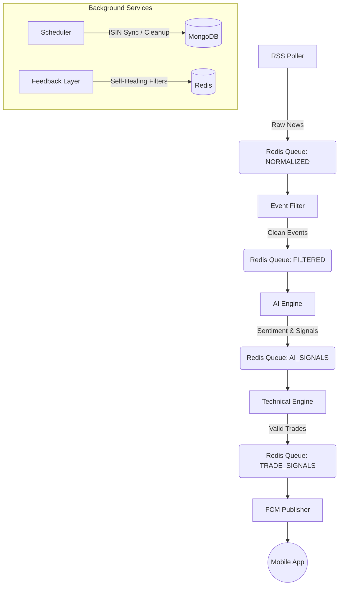

# Stock AI Agent: Institutional-Grade Algorithmic Trading System

**An event-driven, low-latency algorithmic trading engine that fuses Generative AI (Google Gemini) with Technical Analysis (Angel One SmartAPI) to execute news-based trades on the Indian Stock Market (NSE/BSE).**

## 📖 Table of Contents

1. [System Architecture](https://www.google.com/search?q=%23-system-architecture)
2. [Key Features](https://www.google.com/search?q=%23-key-features)
3. [The Decision Pipeline](https://www.google.com/search?q=%23-the-decision-pipeline-how-it-works)
4. [Installation & Setup](https://www.google.com/search?q=%23-installation--setup)
5. [Configuration](https://www.google.com/search?q=%23-configuration)
6. [Module Deep Dive](https://www.google.com/search?q=%23-module-deep-dive)
7. [Deployment](https://www.google.com/search?q=%23-deployment)

---

## 🏗 System Architecture

The system operates on a **Producer-Consumer** model using `asyncio` and `Redis` queues to ensure zero-blocking execution.



---

## ✨ Key Features

### 🧠 1. "Cynical" AI Analysis

Uses **Google gemma** with a specifically engineered "Hedge Fund Persona."

* **PDF Parsing:** Automatically downloads and reads corporate PDFs/XBRL filings.
* **Noise Filtering:** Ignores "Strategic Partnerships" or "MoUs" without financial backing.
* **Tiered Confidence:** Grades signals (Extreme/Very/Moderate) based on concrete data (e.g., Order Value > 20% Market Cap).

### ⚡ 2. Zero-Latency Execution

* **Custom Angel Bridge:** A singleton wrapper around `SmartAPI` that handles session management and Token mapping (NSE/BSE) automatically.
* **No Polling:** Uses direct API calls for 5-minute candles to validate technical setups instantly.

### 🛡️ 3. "Trap" Protection Mechanisms

* **Circuit Breaker:** Blocks trades if the stock has already moved > 12% (Uppercircuit risk).
* **Pump & Dump Shield:** Detects low liquidity stocks (< ₹5L Turnover) with abnormal Relative Volume (RVOL).
* **Intraday Replay:** A unique backtesting logic that replays 5-minute candles to verify if a Stop Loss would have hit before a Take Profit, preventing "fake" win rates.

### 👻 4. Shadow Mode & Self-Healing

* **Shadow Keywords:** Tests new blocklist keywords silently. If a "Shadow Keyword" flags a valid news event, it is automatically removed. If it correctly flags junk, it is promoted to the live blocklist.
* **Leak Analysis:** Nightly jobs analyze accepted events to find noise that slipped through, updating filters automatically.

---

## 🧠 The Decision Pipeline: How it Works

Every news event goes through **4 Gates of Validation** before a trade is signaled.

1. **Gate 1: The Filter (Deduplication & Noise)**
* Checks if the news is about Debt, Mutual Funds, or Routine Compliance.
* Checks `Redis` to see if this story was already processed in the last 24 hours (Semantic Deduplication).


2. **Gate 2: The AI (Fundamental)**
* Reads the full text/PDF.
* Asks: *"Does this impact cash flow immediately?"*
* Assigns a **Signal** (BUY/SELL) and **Confidence Score** (0.0 - 1.0).
* *Threshold:* Must be > `0.65` (Dynamic) to pass.


3. **Gate 3: The Technicals (Price Action)**
* Fetches live 5-minute candles.
* Checks: Is the stock trending? Is it liquid? Is RSI overheated?
* **FOMO Check:** If AI says BUY but price already moved 5%, it blocks the trade.


4. **Gate 4: Execution**
* Calculates Limit Price, Stop Loss (ATR-based), and Take Profit.
* Pushes payload to Firebase Cloud Messaging (FCM).


---

## 🛠 Installation & Setup

### Prerequisites

* Python 3.10+
* MongoDB (Local or Atlas)
* Redis Stack
* Angel One SmartAPI Credentials (with TOTP enabled)
* Google Gemini API Key

### Steps

1. **Clone the Repository**
```bash
git clone https://github.com/Mahakaleeswaran-R/Stock_ai_agent.git
cd Stock_ai_agent

```


2. **Install Dependencies**
```bash
pip install -r requirements.txt

```


3. **Setup Environment Variables**
Create a `.env` file in the root directory:
```ini
# Database
REDIS_URL=redis://localhost:6379
MONGO_URL=mongodb://localhost:27017/

# API Keys
GEMINI_API_KEY=your_gemini_key

# Angel One
ANGEL_API_KEY=your_smartapi_key
ANGEL_CLIENT_ID=your_client_id
ANGEL_PIN=your_pin
ANGEL_TOTP_KEY=your_totp_secret

```


4. **Add Firebase Credentials**
Place your `service-account.json` file in the **root directory**.

---

## 📦 Module Deep Dive

### 1. `main.py` (The Core)

The entry point. It uses `asyncio.create_task` to launch 5 parallel engines:

* `RSSEventFetcher`: Polls BSE/NSE feeds every 15 seconds.
* `EventFilter`: Normalizes data and maps ISIN/Scrip Codes.
* `AIEngine`: Sends prompts to Gemini 1.5 Flash.
* `TechnicalEngine`: Validates signals using `pandas-ta` and `AngelBridge`.
* `FCM_Publisher`: Sends alerts to mobile devices.

### 2. `scheduler.py` (The Maintenance)

Runs on a separate process to handle periodic jobs:

* **08:30 AM:** Syncs ISIN/Token maps from Angel One and BSE website.
* **04:30 PM:** Runs `PerformanceAnalyzer` to grade the day's trades.
* **08:00 PM:** Runs `FeedbackLayer` to optimize filter keywords.
* **11:30 PM:** Purges old Redis keys and Mongo logs.

### 3. `utils/angel_one_bridge.py`

A robust Singleton class that:

* Auto-refreshes Session Tokens every 20 hours.
* Handles **TOTP generation** internally.
* Maps generic symbols ("RELIANCE") to Token IDs ("2885") for both NSE and BSE.

---

## 🚀 Deployment

The system is designed to run in two separate processes:

**Terminal 1: The Real-Time Engine**

```bash
python main.py

```

**Terminal 2: The Scheduler**

```bash
python scheduler.py

```

### Docker Deployment (Optional)

```dockerfile
FROM python:3.13-slim
WORKDIR /app
COPY . .
RUN pip install -r requirements.txt
CMD ["python", "main.py"]

```

---

## ⚠️ Disclaimer

*This software is for educational purposes only. Algorithmic trading involves significant risk. I'm not responsible for any financial losses incurred by using this software.*
